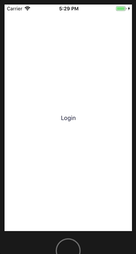
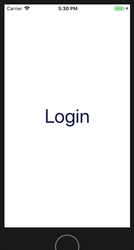
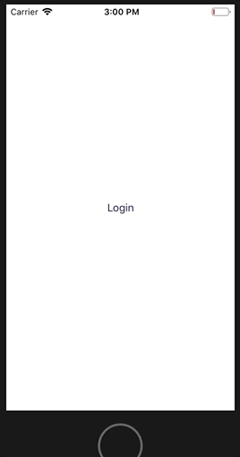

# A customised, and accessible, Firebase login view controller

Want to add Firebase login to an iOS app, with support for various social media login options? Easy, just [follow the steps](https://firebaseopensource.com/projects/firebase/firebaseui-ios/firebaseauthui/readme.md) on the Firebase website and you're all set.

    // In a view controller, far far away...
    func login(_ sender: UIButton) {
      guard let authUI = FUIAuth.defaultAuthUI() else {
        return
      }

      authUI.delegate = self
      authUI.providers = [
        FUIGoogleAuth(),
        FUITwitterAuth()
      ]

      show(authUI.authViewController(), sender: sender)
    }

The code above will prepare the standard Firebase authentication view controller, it's set up to show login options for Google, Twitter and standard Email & Password.

Here's what happens:

Ok, simple enough. If this design isn't to your liking you can customise the view controller to provide a different colour scheme for the background, or the navigation bar, add some nice images, change the button text by providing a different text bundle and a [whole other load of stuff](https://firebaseopensource.com/projects/firebase/firebaseui-ios/firebaseauthui/readme.md/#customizing_firebaseui%20for%20authentication).

However the Firebase documentation tells us we can customise everything about the authentication method picker screen, **except for the actual sign-in buttons** and their position. This isn't great. Look what happens when we open the app with the largest Accessibility text size:

Unfortunately the standard Firebase authentication view controller does not support dynamic type. If we want to create an app that supports dynamic type (and we do!) then Firebase's authentication picker isn't going to cut it. We need to write our own.

## What I'm not going to do
This is going to be a long post so I can't go into detail beyond the scope of a custom login flow, I apologise in advance. You should already know how to configure Firebase in your app before you attempt any of this.

## A taster
Here's what we're going to make

 

The login screen will be a subclass of `UIViewController`, not the Firebase authentication picker screen, so we'll have to dive into the Firebase SDK a little to extract everything we need.

## Authentication Providers
Social media login is represented by the `FUIAuthProvider` protocol. There are concrete instances of `FUIGoogleAuth`, `FUITwitterAuth` etc that handle almost everything we need when authenticating via these login methods.

The providers also give us styling information in terms of brand colour schemes and icons, which will come in handy, plus the text displayed in the buttons - localized to almost 90 different languages.

One thing to note is we will also be providing login via email and password in this example, but there is no concrete instance of an email `FUIAuthProvider`, so we'll have to handle that separately.

## Some prep
When displaying large text sizes I shorten the text in the button to something that fits better within its bounds. I use the following protocol extension to check for when I should do that.

    extension UITraitEnvironment {
      var isDisplayingLargeText: Bool {
        return traitCollection.preferredContentSizeCategory.isAccessibilityCategory
      }
    }

Also, I'll need to access the Firebase bundle for some resources and localised strings, so I'll create a simple wrapper for the bundle

    struct FirebaseBundle {
      static let loginLabel = "Login"
      static let emailIcon = "ic_email"
      static let bundleName = "FirebaseAuthUI"
      static let emailShortName = "Email"
      static let emailSignInLabel = "SignInWithEmail"

      private static let bundle: Bundle = {
        guard
            let firebaseBundleURL = Bundle.main.url(forResource: bundleName, withExtension: "bundle"),
            let bundle = Bundle(url: firebaseBundleURL)
        else {
            fatalError("Missing FirebaseAuthUI bundle")
        }

        return bundle
      }()

      static func localizedString(_ key: String) -> String {
        return bundle.localizedString(forKey: key, value: nil, table: bundleName)
      }

      static func image(named imageName: String) -> UIImage {
        guard let image = UIImage(named: imageName, in: bundle, compatibleWith: nil) else {
            fatalError("Invalid bundle contents")
        }

        return image
      }
    }

## Let's make the buttons
Here's a breakdown of the properties of the login buttons we want to make.

|Property|Provided by|
|Round corners|`layer.cornerRadius` set to 20|
|Self sizing for dynamic text|Make height ≥ 2 x corner radius|
|Button image|`FUIAuthProvider.icon`|
|Button text|`FUIAuthProvider.signInLabel`|
|Button text for large text sizes|`FUIAuthProvider.shortName`|
|Button background colour|`FUIAuthProvider.buttonBackgroundColor`|
|Button border colour|Same as the text colour if the background is white, otherwise clear|

Note the height constraint must be **greater than or equal to** otherwise the buttons won't resize for dynamic type.

Everything above is fine for Google and Twitter, but for Email we need to provide our own accessors for the same properties as there is no email `FUIAuthProvider`. The Firebase bundle `FirebaseAuthUI` provides an email icon (`ic_email`), plus all the localized strings for the button text. Buried somewhere in the code is the RGB code for the button background colour too.

Here's a helper that gives us all that data

    struct FirebaseEmailAuthentication {
      static let icon = FirebaseBundle.image(named: FirebaseBundle.emailIcon)
      static let shortName = FirebaseBundle.localizedString(FirebaseBundle.emailShortName)
      static let signInLabel = FirebaseBundle.localizedString(FirebaseBundle.emailSignInLabel)

      static let buttonBackgroundColor = #colorLiteral(red: 0.8156862745, green: 0.007843137255, blue: 0.1058823529, alpha: 1)
      static let buttonBorderColor = UIColor.clear
      static let buttonTextColor = UIColor.white
    }

Now we know what we want from a provider, or the email defaults, we can define a view model for the button. It contains an optional provider and defaults to email if there is none provided

    struct FirebaseLoginButtonViewModel {
      /// If the provider is nil we default to email
      let provider: FUIAuthProvider?

      var signInLabel: String {
        if UIScreen.main.isDisplayingLargeText {
          return provider?.shortName ?? FirebaseEmailAuthentication.shortName
        }

        return provider?.signInLabel ?? FirebaseEmailAuthentication.signInLabel
      }

      var icon: UIImage {
        return provider?.icon ?? FirebaseEmailAuthentication.icon
      }

      var buttonBackgroundColor: UIColor {
        return provider?.buttonBackgroundColor ?? FirebaseEmailAuthentication.buttonBackgroundColor
      }

      var buttonBorderColor: UIColor {
        return provider?.buttonTextColor ?? FirebaseEmailAuthentication.buttonBorderColor
      }

      var buttonTextColor: UIColor {
        return provider?.buttonTextColor ?? FirebaseEmailAuthentication.buttonTextColor
      }

      var buttonBorderWidth: CGFloat {
        return (buttonBorderColor == .clear ? 0.0 : 1.0)
      }
    }

Note for `signInLabel` we check to see if we're displaying large text and return the appropriate string as needed.

Now we can create a button and pass it this view model.

    class FirebaseLoginButton: UIButton {
      static let cornerRadius: CGFloat = 20.0

      private let viewModel: FirebaseLoginButtonViewModel

      init(with viewModel: FirebaseLoginButtonViewModel) {
        self.viewModel = viewModel
        super.init(frame: .zero)

        setup()
      }
    }

Here we've set our corner radius as a constant so we (and other objects) can reference it later.

All we need now is to implement `setup` where we set the button's radius, border width, background colour, border colour, text colour, text and icon directly from the view model, which gets everything from the `FUIAuthProvider` or Email defaults.

    private extension FirebaseLoginButton {
      static let inset: CGFloat = 16.0

      func setup() {
        titleLabel?.font = UIFont.preferredFont(forTextStyle: .subheadline)
        titleLabel?.numberOfLines = 0

        layer.cornerRadius = FirebaseLoginButton.cornerRadius
        contentHorizontalAlignment = .left

        backgroundColor = viewModel.buttonBackgroundColor
        layer.borderColor = viewModel.buttonBorderColor.cgColor
        layer.borderWidth = viewModel.buttonBorderWidth

        setTitle(viewModel.signInLabel, for: .normal)
        setTitleColor(viewModel.buttonTextColor, for: .normal)
        setImage(viewModel.icon, for: .normal)

        titleEdgeInsets = UIEdgeInsets(top: 0, left: FirebaseLoginButton.inset, bottom: 0, right: 0)
        imageEdgeInsets = UIEdgeInsets(top: 0, left: FirebaseLoginButton.inset * 0.667, bottom: 0, right: 0)
      }
    }

In order to get dynamic text working we need to set `numberOfLines` to zero and, most importantly, we override the button's font to be one that supports dynamic text, so we use `preferredFont(forTextStyle:)`. If we forget this part then the button text will remain a fixed height.

Getting the text and icon into the right position is a bit of a hack, but you can fiddle with insets and play around to see which works best for you. You can also play around with the button's reaction to being highlighted or selected for some visual feedback, but that's up to you.

It would be nice to create a view controller whose `init` method takes the `FUIAuthProvider`s we want to support and for it to display the associated login buttons. To do this I'll define a simple struct that wraps an optional `FUIAuthProvider`, we need it to be optional because a nil `FUIAuthProvider` will correspond to email. I'll also create some static presets for the types I know in advance that I'll need

    struct FirebaseLoginType {
      let authProvider: FUIAuthProvider?

      static let google = FirebaseLoginType(authProvider: FUIGoogleAuth())
      static let twitter = FirebaseLoginType(authProvider: FUITwitterAuth())
      static let email = FirebaseLoginType(authProvider: nil)
    }

`FirebaseLoginType.google` is a login type wrapper for the `FUIGoogleAuth` concrete type, `FirebaseLoginType.twitter` the wrapper for `FUITwitterAuth` and `FirebaseLoginType.email` is a `nil` wrapper, because there is no `FUIAuthProvider` for email.

## Creating the login screen
Let's start with the initialisation of the view controller, which we'll call `FirebaseLoginViewController`

    class FirebaseLoginViewController: UIViewController {
      private let loginTypes: [FirebaseLoginType]
      private let onLogin: (Result<String>) -> Void

      init(with loginTypes: [FirebaseLoginType], onLogin: @escaping (Result<String>) -> Void) {
        self.loginTypes = loginTypes
        self.onLogin = onLogin

        super.init(nibName: nil, bundle: nil)
      }
    }

This view controller takes a list of logins we want to show, plus a callback `onLogin` that we'll call when login completes.

So far, so good. I would point out that in a real world example I wouldn't use an `Array` but rather a `Set<FirebaseLoginType>`, to avoid unnecessary duplicates, but in order to do that I'd have to make `FirebaseLoginType` conform to `Hashable` which is out of scope for what I want to do here.

I'll need to display each of the buttons corresponding to the login type. I'll do that by creating each button and putting them into a `UIStackView` and positioning the stack view at the bottom of the screen.

    private extension FirebaseLoginViewController {
      static let buttonSpacing: CGFloat = 24.0
      static let buttonWidth: CGFloat = 250.0

      func loginButton(for loginType: FirebaseLoginType) -> FirebaseLoginButton {
        let button = FirebaseLoginButton(with: FirebaseLoginButtonViewModel(provider: loginType.authProvider))

        button.translatesAutoresizingMaskIntoConstraints = false
        button.heightAnchor.constraint(greaterThanOrEqualToConstant: 2 * FirebaseLoginButton.cornerRadius).isActive = true
        button.widthAnchor.constraint(equalToConstant: FirebaseLoginViewController.buttonWidth).isActive = true

        return button
      }
    }

I've hard coded the button width to `250` points. It's a good enough size on large and small screens.

As mentioned before, the button's `heightAnchor` is set to `greaterThanOrEqualToConstant`, to allow the button to self size with dynamic text.

Now in my `viewDidLoad` I will create my stack view, position it where I want it onscreen and add the buttons.

    override func viewDidLoad() {
      super.viewDidLoad()

      title = FirebaseBundle.localizedString(FirebaseBundle.loginLabel)
      view.backgroundColor = .white

      let stackView = UIStackView(arrangedSubviews: loginTypes.map(loginButton(for:)))
      stackView.axis = .vertical
      stackView.spacing = FirebaseLoginViewController.buttonSpacing

      view.addSubview(stackView)
      stackView.translatesAutoresizingMaskIntoConstraints = false
      stackView.centerXAnchor.constraint(equalTo: view.centerXAnchor).isActive = true
      stackView.bottomAnchor.constraint(equalTo: view.safeAreaLayoutGuide.bottomAnchor,
                                        constant: -FirebaseLoginViewController.buttonSpacing).isActive = true
    }

The `loginTypes` are turned into `FirebaseLoginButton`s by `Array`'s `map` method `loginTypes.map(loginButton(for:))`. Isn't Swift just awesome?

And there we have it, all that remains is to instantiate this view controller somewhere, with the required login types, and present it onscreen. Up to you if you do that in your root view controller or a coordinator. Here it is in the standard `ViewController` that's given to you each time you create a new project.

As you can see I pass `[.google, .twitter, .email]` as the login types and they're displayed onscreen in the order I specified.

    // The parent view controller
    private extension ViewController {
      @objc
      func login(_ sender: UIButton) {
        let loginViewController = FirebaseLoginViewController(with: [.google, .email],
                                                              onLogin: onLogin)
        let navigationController = UINavigationController(rootViewController: loginViewController)

        let cancelButton = UIBarButtonItem(barButtonSystemItem: .cancel, target: self, action: #selector(cancel(_:)))
        navigationController.navigationBar.topItem?.leftBarButtonItem = cancelButton

        show(navigationController, sender: sender)
      }

      @objc
      func cancel(_ sender: UIBarButtonItem) {
        dismiss(animated: true, completion: nil)
      }
    }

And now, with no extra effort, here is your custom, dynamically resizing, Firebase backed, login screen, in Japanese.

In the next post I'll go into the details of how you will actually login using this screen.
