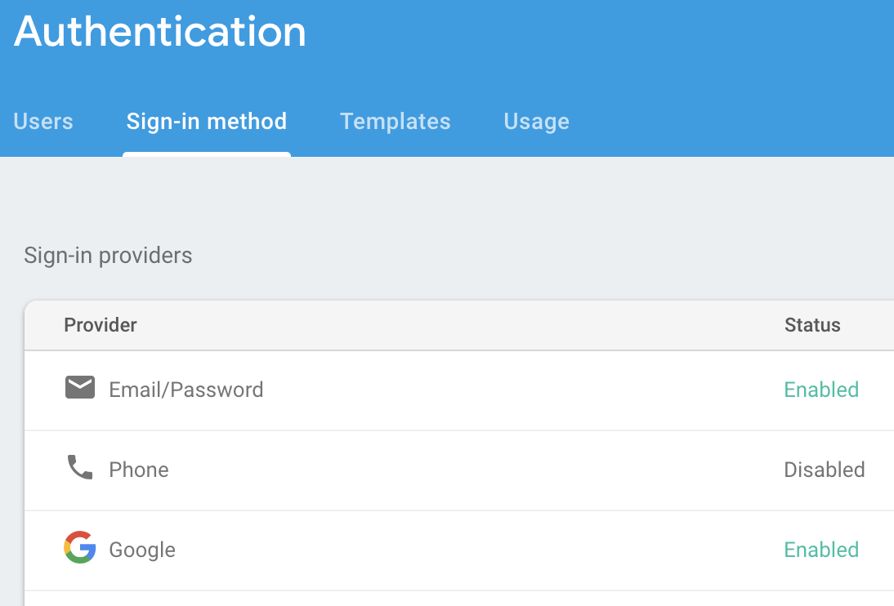
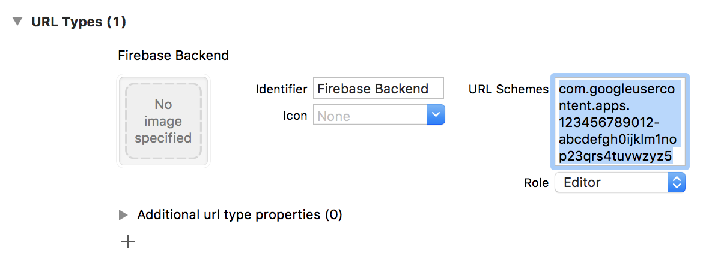
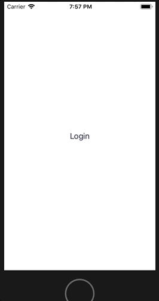

At this point we have a UI. It localises nicely, its buttons are nicely branded in terms of icons and colours and it supports dynamic text. Let move on to making it responsive.

There are a number of steps needed to get social media sign-in set up in your app. You must:

1. Configure Firebase
1. Enable the social media platform as a sign-in option in the Firebase console
1. Configure the app according to each Social Media provider's needs
1. Add the Social Media provider's URL scheme as a support URL in your `Info.plist`

### Configure Firebase
Just `import Firebase` in `AppDelegate.swift` and add `Firebase.configure()` on launch.

Ha, just kidding, don't do that, it's horrible. [Do this instead](http://www.apokrupto.com/blog-1/2017/5/16/default-protocol-extensions-for-loose-coupling)

### Enable social media sign-in
On the [Firebase console](https://console.firebase.google.com), in the `Auth` section under `Sign-in method`, enable your required sign-in provider.

### Configure the app
This step is out of scope for this article. Each of Google, Twitter, Facebook etc require you to perform different steps before allowing your app to authenticate to their platforms.

Follow the relevant links to setting up each Social Media authentication [here](https://firebase.google.com/docs/auth/)

### Add the URL scheme
Your Firebase config file, `GoogleService-Info.plist`, contains a number of keys and identifiers. The `REVERSED_CLIENT_ID` identifier contains the URL scheme for Google Sign-in.

Copy and paste the URL scheme into the `URL Types` in the `Info` section of your target app in your project. You will need to add a URL scheme for each of the Social Media providers you support. Details are in the Social Media authentication chapters [here](https://firebase.google.com/docs/auth/)

## Logging in on Social Media
That's all the preliminary steps out of the way, let's try to sign in.
There are two phases to social media sign-in:

1. You must first sign-in to the social media provider in order to get an authentication credential specific to that social media platform
1. You log into Firebase with that credential and get back your Firebase user, represented by a `FIRUser` instance.

Social media sign-in appears on your app as a web view presented modally. You get this sign-in screen by calling `signIn(withDefaultValue:presenting:completion:)` with your concrete `FUIAuthProvider` instance.

Once you have your credential you authenticate yourself in Firebase calling `signInAndRetrieveData(with:completion:)` on an instance of the `Auth` class. You can use a default instance by calling `Auth.auth()` and the `completion` is an `AuthDataResultCallback`, which is a `typealias` for a closure of type `(AuthDataResult?, Error?) -> Void`. `AuthDataResult` is a class that gives your the logged in user plus some other stuff.

Now we can pass the username back to the view controller or coordinator that instantiated the login view controller and let it decide the next steps. A real life implementation would do more than this, with error handling, a `Result` type etc., but this is enough for example purposes.

In our `FirebaseLoginViewController` we can define a login method for our `FirebaseLoginButton`s and add it as a target of the button for a tap event.

    private extension FirebaseLoginViewController {
      @objc
      func login(_ sender: FirebaseLoginButton) {
        // 1. Here we access the button's FUIAuthProvider
        guard let authProvider = sender.provider else {
            return
        }

        login(with: authProvider)
    }

    func login(with authProvider: FUIAuthProvider) {
        // 2. Social media sign-in to retrieve the credential, with the
        // login view controller as the presenting view controller for the
        // web view modal
        authProvider.signIn(withDefaultValue: nil, presenting: self) { [unowned self] (credential, providerError, callback) in
          guard let credential = credential else {
            callback?(nil, providerError)
            self.onLogin(.failure(providerError))
            return
          }

          // 3. Firebase authentication with the credential
          Auth.auth().signInAndRetrieveData(with: credential) { [unowned self] (result: AuthDataResult?, authError: Error?) in
            guard let result = result else {
              callback?(nil, authError)
              self.onLogin(.failure(authError))
              return
            }

            callback?(result.user, nil)
            self.onLogin(.success(result.user.displayName ?? "Stranger"))
          }
        }
      }

      func loginButton(for loginType: FirebaseLoginType) -> FirebaseLoginButton {
        let button = FirebaseLoginButton(with: FirebaseLoginButtonViewModel(provider: loginType.authProvider))        
        button.addTarget(self, action: #selector(login(_ :)), for: .touchUpInside)
        // ...

        return button
      }
    }

To get part `1.` to work we need to add a property to our `FirebaseLoginButton` to access the `FUIAuthProvider`

    extension FirebaseLoginButton {
      var provider: FUIAuthProvider? {
        return viewModel.provider
      }
    }

Putting this all together, and implementing a suitable `onLogin` callback when launching my login screen, I can now open my login screen, choose Google sign-in, walk through the steps presented to get my Google credentials, login to Firebase with that credential and dismiss the login screen.

In my `onLogin` I chose to display a welcome message using the returned user name. Here's the final result

## Advanced bit I wish I didn't have to tell you about
But wait, what was that activity spinner doing in the UI? I didn't tell you I was going to do it.

Correct. But that's because I didn't do it. So, ugh, get this, when you log in with either Google or Facebook sign-in, the Firebase SDK automatically puts an activity indicator onscreen, whether you want one or not.

And that code is buried deep in the SDK. Ok, you could go in and remove the line, but then you'll have to fork the Firebase SDK and keep it up to date and it's a whole big thing. Not interested.

The activity indicator appears because of a static method on `FUIAuthBaseViewController`, which you may remember is the standard UI we're trying to replace because it doesn't support dynamic type.

But `FUIGoogleAuth`, the Google `FUIAuthProvider`, always expects the presenting view controller to be a `FUIAuthBaseViewController`, and it calls the static method `addActivityIndicator(_:)` which returns a `UIActivityIndicatorView`.

So what can we do? I don't want that spinner there, and neither do you. Hang on to your hats, folks, we're going swizzling.

I'm going to create a simple method that does returns nil instead of a `UIActivityIndicatorView` instance, and replace the `FUIAuthBaseViewController.addActivityIndicator(_:)` method with this dummy method.

Oooooh, playing with the Objective-C runtime in Swift, how naughty.

    func disableActivitySpinnerPresentation() {
      guard
        let method = class_getClassMethod(FUIAuthBaseViewController.self,
                                          #selector(FUIAuthBaseViewController.addActivityIndicator(_ :)))
      else {
        return
      }

      let emptyBlock: @convention(block) (UIView) -> UIActivityIndicatorView? = { _ in
        return nil
      }

      method_setImplementation(method, imp_implementationWithBlock(emptyBlock))
    }

Call the above method once to set up the swizzling, ideally [wherever you called `Firebase.configure`](http://www.apokrupto.com/blog-1/2017/5/16/default-protocol-extensions-for-loose-coupling)

`@convention(block)` tells the compiler that `emptyBlock` is an Objective-C compatible block reference, which allows us to pass it to `imp_implementationWithBlock`. This is similar to using `@objc` to mark a function as being Objective-C compatible

Now our app will login, the `addActivityIndicator(_:)` method will be called and return a nil value, so nothing is displayed.

## And we're done
In the next post I'll add email and password based login.
