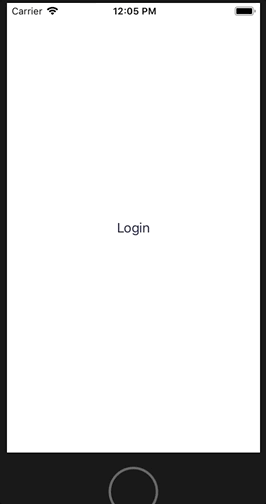
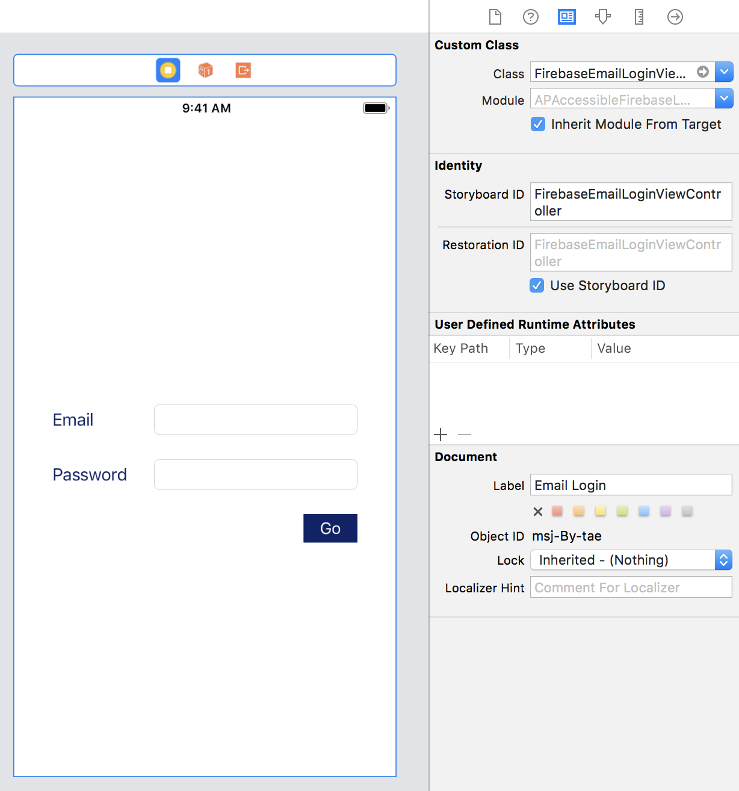

In part 2 we looked at how to add social media based sign in to our custom login view controller. Now we'll have a look at implementing our own email-based sign-in.

Social sign-in displayed a webview in order to get the user's credentials, for email sign-in we will need our own view that will prompt for email and password. Lets have a look ahead to what we're going to do

Up to now we've done all our UI in code. I'm going to do this screen via Storyboards because I want to avoid a load of autolayout code in the snippets below when that's not the focus of this article.

## Email login screen requirements
I want the following features in my login screen

1. Email text entry field
1. Password text entry field
1. The UI should adjust when the keyboard appears

In our view we'll have outlets for email and password entry, plus a completion handler for the sign-in step. The completion is an `AuthDataResultCallback`, as described in the previous post.

We'll put the UI elements into a new `FirebaseEmailLoginView` view. In order to handle the keyboard appearing and disappearing we'll center that view in a full screen `UIView`, which I'll refer to as the `containerView`.

In our login view controller we'll keep have an `IBOutlet` to the `containerView`'s bottom layout constraint and change its constant value to match the height of the keyboard when it appears, and set it back to zero when it disappears.

This will give us a UI that automatically resets itself so that the login view stays centered in the visible area

Here's our login view

    class FirebaseEmailLoginView: UIView {
      @IBOutlet var emailTextField: UITextField!
      @IBOutlet var passwordTextField: UITextField!

      var completion: AuthDataResultCallback = { _, _ in }

      @IBAction
      func signIn(_ sender: UIButton) {
        guard
          let email = emailTextField.text,
          !email.isEmpty,
          let password = passwordTextField.text,
          !password.isEmpty
        else {
          return
        }

        loginOrCreateUser(withEmail: email, password: password)
      }
    }

We have outlets to our text entry fields for email and password and we have a completion block that we can set before presenting an instance of this view, plus the action that is performed when the `Go` button is tapped.

Here's our view controller

    class FirebaseEmailLoginViewController: UIViewController {
      private var keyboardObserver: KeyboardObserver!

      @IBOutlet var loginView: FirebaseEmailLoginView! {
        didSet {
          loginView.completion = completion
        }
      }

      @IBOutlet var bottomConstraint: NSLayoutConstraint! {
        didSet {
          keyboardObserver = KeyboardObserver(anchoredTo: bottomConstraint)
        }
      }

      var completion: AuthDataResultCallback = { _ , _ in }
    }

We have outlets for the login view and for the bottom layout constraint of the `containerView` so we can react to the keyboard.

Observing the keyboard showing and hiding shouldn't be the responsibility of the view controller, instead I add a `KeyboardObserver` object that handles all that. This object does all the listening for `UIResponder.keyboardWillShowNotification` and `UIResponder.keyboardWillHideNotification` notifications and adjusts the bottom constraint as necessary. The code is out of scope for this article, but it is available [in this gist]()

The view controller has a `completion` callback, which is just passed to the login view.

## Sign-in
Email sign-in is simpler compared to social media in the sense that we don't have an asynchronous call for contacting the social media provider to get a credential before we perform a second asynchronous call to login to Firebase. We just get the user's email and password and immediately sign-in to Firebase.

A slight complication is for email we need to know if we are logging in with a returning user, or if we are creating a new account.

Depending on your design you might have separate screens for these two scenarios, in which case you only need to use one of the following asynchronous calls on an `Auth` instance.

1. To create a user you call `createUser(withEmail:password:completion:)`
1. To sign in with an existing user call `signIn(withEmail:password:completion:)`.

Both methods require a user's email address and a password, plus an optional `AuthDataResultCallback` completion handler.

However, if you don't want to bother the user with having to choose between separate screens, you can just show a single screen that asks the user for their email address and password and then sign-in if their account already exists in the backend or create an account if it doesn't.

## Checking for an existing account
We can see if the user's email address is already present in the backend by calling `fetchProviders(forEmail:completion:)`

    extension FirebaseEmailLoginView {
      func loginOrCreateUser(withEmail email: String, password: String) {
        Auth.auth().fetchProviders(forEmail: email) { [weak self] providers, error in
          guard let self = self else {
            return
          }

          if let error = error {
              self.completion(nil, error)
              return
          }

          if (providers ?? []).contains("password") {
            Auth.auth().signIn(withEmail: email,
                               password: password,
                               completion: self.completion)
          }
          else {
            Auth.auth().createUser(withEmail: email,
                                   password: password,
                                   completion: self.completion)
          }
        }
      }
    }

In the `fetchProviders` completion handler we get a array of `String`s that specify the supported login methods for this email address.

If the string `"password"` is in the array then the user has previously created an account for email & password sign-in, and we can sign in. If the string is not present then we have to create the user.

If `error` is `nil` and `providers` is also `nil` then this should be treated the same as receiving an empty `providers` array.

Note that the code above is bare bones and doesn't take into account the possibility that the `providers` array contains other strings, which it will do if the email address has been used to for social sign-in. Firebase lets you choose whether you will allow the user to sign-in with the same email address as a previous social sign-in, if you allow it then the code about will work, if you disallow it then the completion handler will be passed an error.

## Adding email sign-in
In our `FirebaseLoginViewController` we modify our `FirebaseLoginButton`'s `login` action to support logging in with the email view controller if the button doesn't have an authentication provider.

    private extension FirebaseLoginViewController {
      @objc
      func login(_ sender: FirebaseLoginButton) {
        guard let authProvider = sender.provider else {
          loginWithEmail()
          return
        }

        login(with: authProvider)
      }

      func loginWithEmail() {
        let emailLoginViewController: FirebaseEmailLoginViewController = UIStoryboard.main.instance()

        emailLoginViewController.completion = { [unowned self] (result, error) in
          guard let result = result else {
            self.onLogin(.failure(error))
            return
          }

          self.onLogin(.success(result.user.displayName ?? result.user.email ?? "Stranger"))
        }

        show(emailLoginViewController, sender: self)
      }
    }

To get an instance of the email view controller from the storyboard I use the following extension on `UIStoryboard`

    extension UIStoryboard {
      func instance<T: UIViewController>() -> T {
        return instantiateViewController(withIdentifier: String(describing: T.self)) as! T
      }
    }

    extension UIStoryboard {
      static let main = UIStoryboard(name: "Main", bundle: nil)
    }

This works on the principle that the view controller is given a storyboard ID that matches its class name.

## And we're done
In the next article I'll discuss a very important accessibility issue with this UI that has ramifications for everything you display.
