*I was going to call this "A customised, and accessible, Firebase login view controller. Part 4 - Scroll all the things!", but while this article completes the 4 part series it also stands alone as this article can be applied to all of your user interface.*

We have an email login screen, it's quite simple. Let's have a look at what our UI looks like on the iPhone XR and the iPhone SE

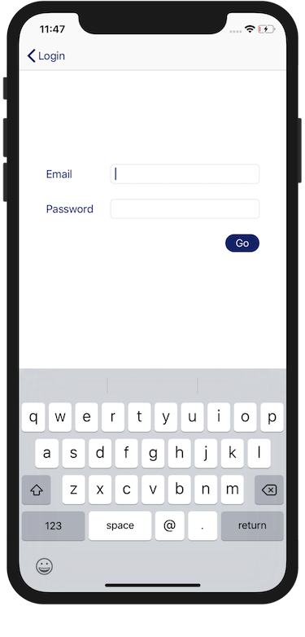

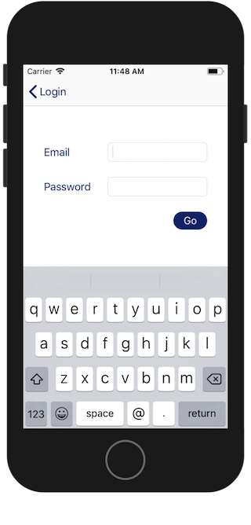

All very nice, everything lines up properly when the keyboard appears.

However, as our text gets larger the text entry fields start to shrink to accommodate the labels to the left of them. In our storyboard we created this layout using horizontal stack views that align the text labels ("Email" or "Password") alongside a `UITextField`. A simple fix for this is to change these stack views so they align vertically when necessary. Here's the storyboard with the stack views highlighted

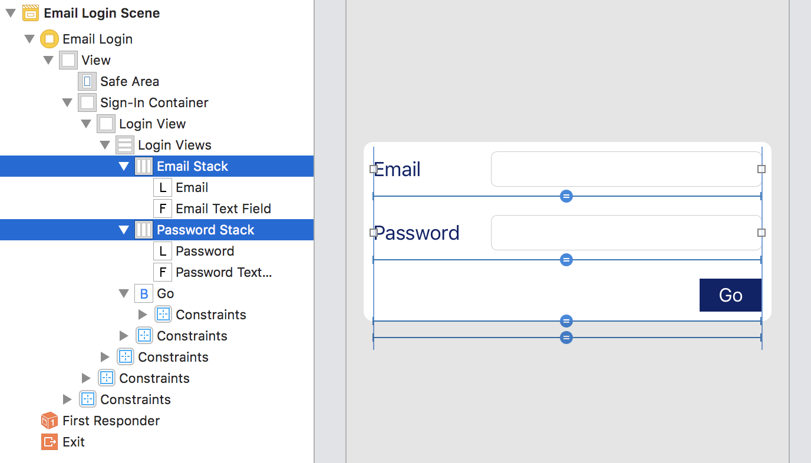

 We'll create an `IBOutletCollection` with these two stack views (`Email Stack` and `Password Stack` in the storyboard)

    class FirebaseEmailLoginView: UIView {
      // Contains 'Email Stack' and 'Password Stack'
      @IBOutlet var textEntryViews: [UIStackView]!

      // ...
    }

We could have had individual `IBOutlet`s for each stack view, but an `IBOutletCollection` is more scalable.

Now we modify the stack views when the app's traits change.

    extension FirebaseEmailLoginView {
      override func traitCollectionDidChange(_ previousTraitCollection: UITraitCollection?) {
        super.traitCollectionDidChange(previousTraitCollection)

        let axis: NSLayoutConstraint.Axis = (isDisplayingLargeText ? .vertical : .horizontal)

        textEntryViews.forEach {
          $0.axis = axis
        }
      }
    }

Here we're using the `isDisplayingLargeText` property on `UITraitEnvironment` that we introduced in part 1 to decide what the stack view's `axis` property should be.

So what will this look like with an AccessibilityXL text size?

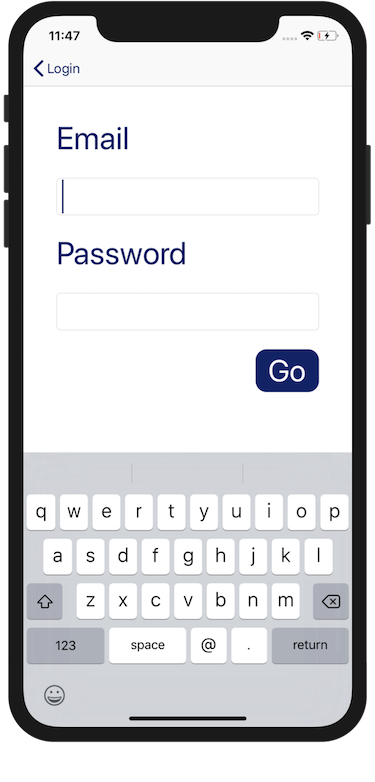

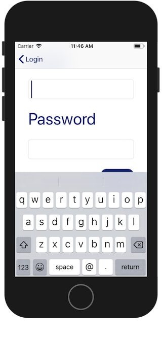

The XR has enough real estate to accommodate the new vertical layout, but not the SE. The user can't see that the first text entry is for email and they can barely tap the `Go` button. And the truth is for someone who needs to have text this large then "barely" seeing the `Go` button means they can't see the `Go` button at all.

It's clear that we made a poor decision when creating our UI, we didn't think about what would happen to the layout when displaying larger text. There really isn't anything we can do to create more space onscreen, so we need another solution that accommodates this scenario. The simplest solution is to add scrolling.

There are a number of options available to us in this case. We can use a `UIScrollView`, a `UITableView` or even a `UICollectionView`, throw our stack view into it and call it a day. But nothing in our original design suggested that the UI should scroll, so scrolling should only be present when required and the UI should display as initially intended (i.e. non-scrolling) when it isn't.

Each time I find myself in this situation the solution might be different. It's pretty obvious how a `UITableView` or `UICollectionView` would fix this situation, so let's look at how I might use a `UIScrollView` using This One Neat Trick™.

## Scrolling a stack
If you embed a `UIStackView` in a `UIScrollView` then that stack view will scroll if the stack's bounds are bigger than the scroll view's. If the stack's bounds are smaller then there will be no scroll. So if I adapt my login screen to use scrolling and stacking then I will get conditional scrolling for free, while I would have to manually set it if I was using `UITableView` or `UICollectionView`.

I'll add my scroll view with constraints for top and bottom safe areas, centered horizontally and 0.88 the width of its superview.

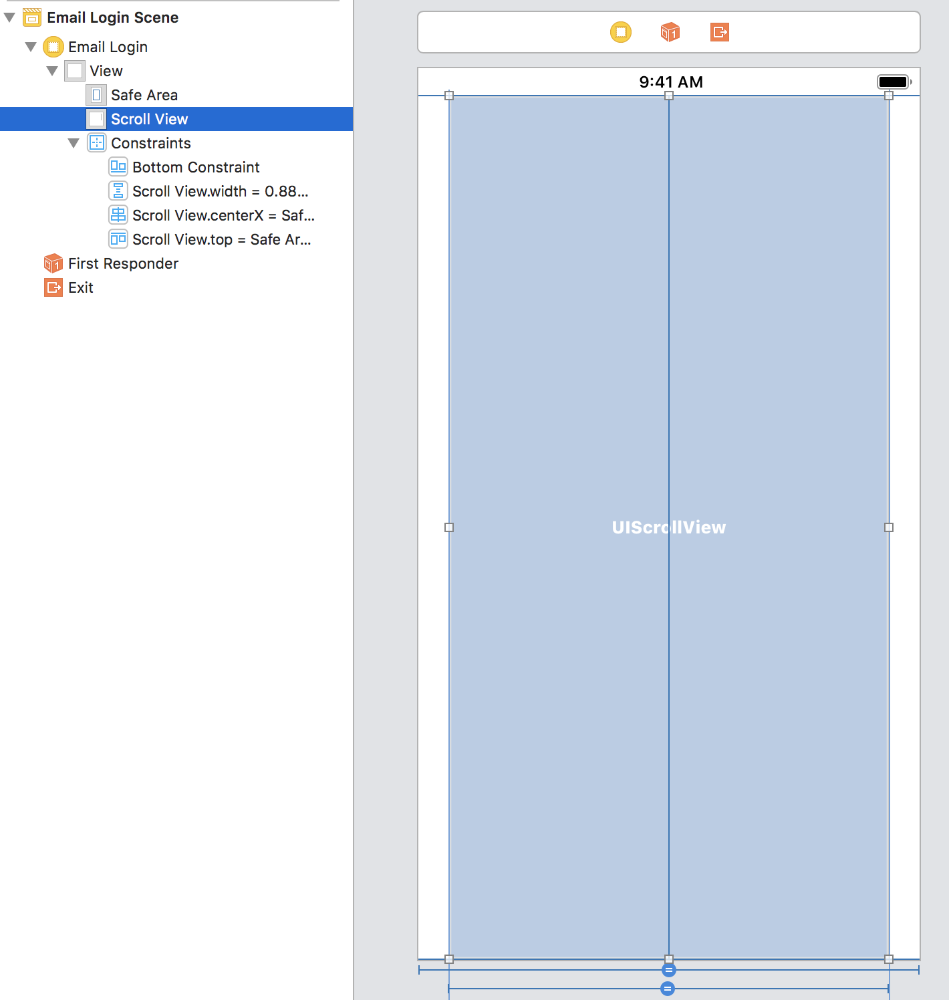

Now I'll add my stack view to this scroll view. Setting its top, bottom, leading and trailing constraints to fit the scroll view.

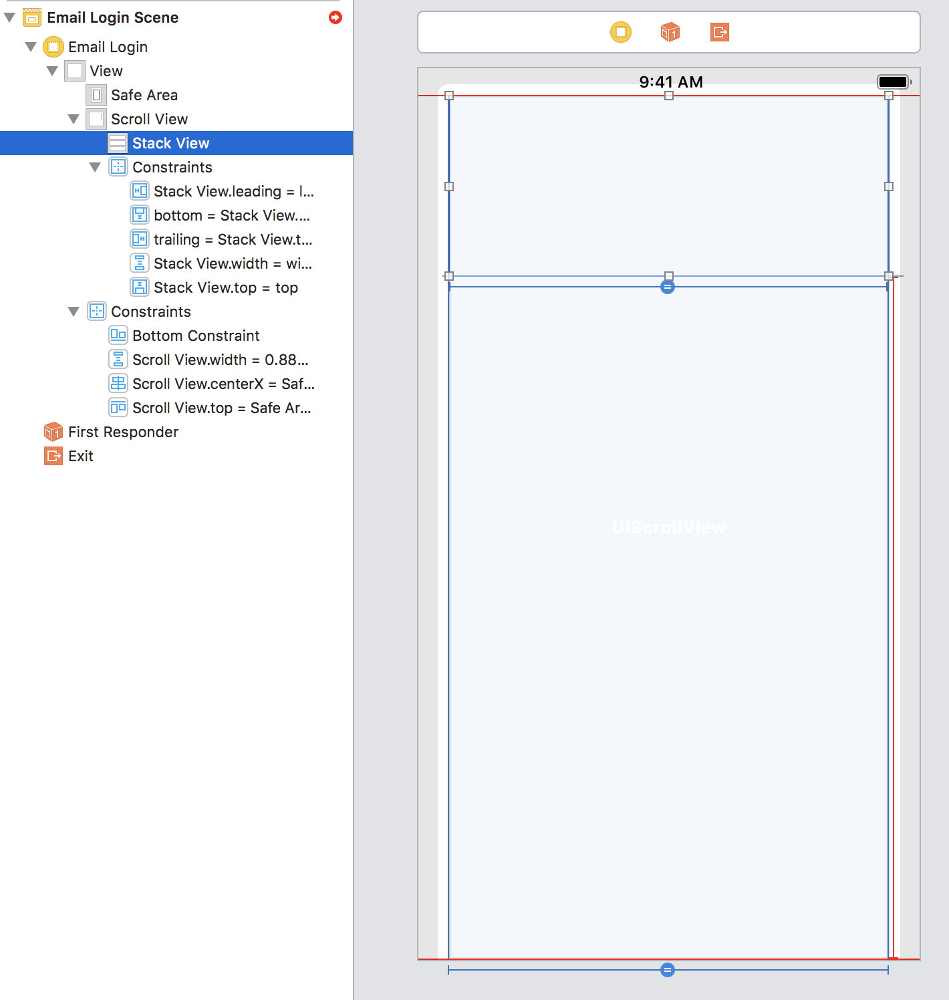

You'll notice there's a fifth constraint where I also set the stack view's width to equal the scroll view. For some reason auto-layout needs this, even though I've also set the leading and trailing constraints.

At this point Interface Builder is showing red layout warnings everywhere. That's ok, we get rid of them by populating the stack view, which we'll do now.

I'll add the `FirebaseEmailLoginView` that I used in the original layout.

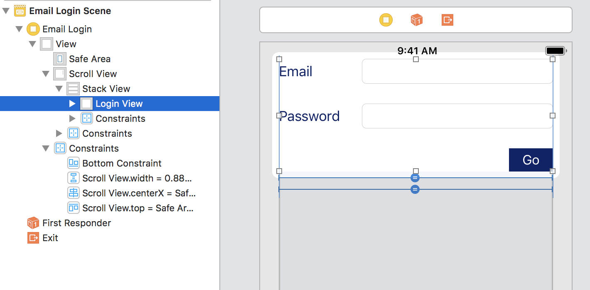

## Adjusting the stack size
What we have now is a view that will scroll if necessary, so we've made progress, but it has left the login view stuck to the top of the screen. The original design was for the login view to be centered.

What we need is for the stack view to have a padding view above and below the login view and for these views to grow or shrink in size in order to fit the available space. I've given them a (nasty) background colour just so you can see them.

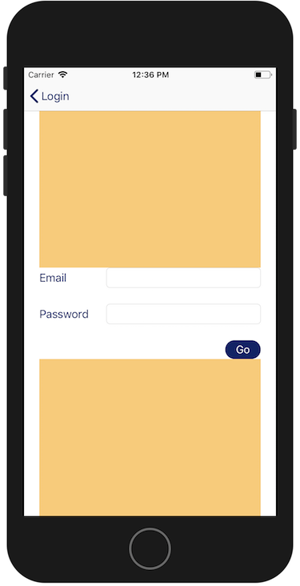

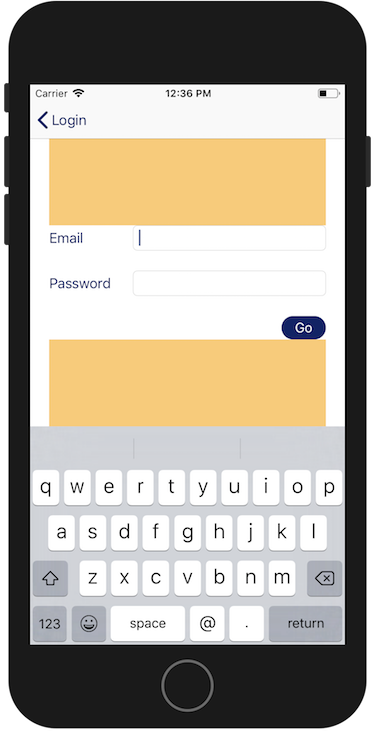

I'll add these padding views to the stack view and set their height constraints to something small.

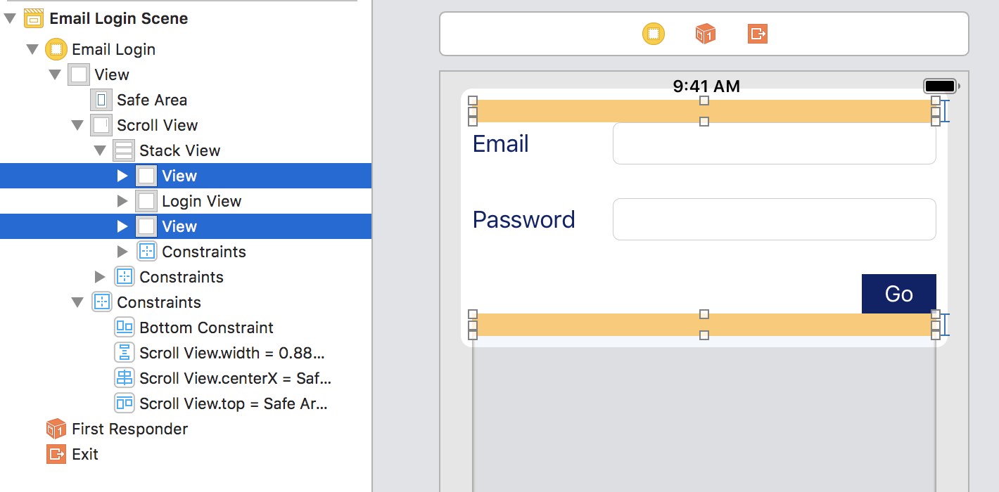

I'll create a helper object that will modify the height constraint for these two padding views depending on the size of the scroll view or stack view.

This helper will need the following

1. To observe the scroll view and stack view for bounds changes (keyboard appearing etc)
1. The constraints to adjust
1. The original constraints so we can recalculate more changes, we need to always know the initial values.

    class AccessibleLayout {
      private let initialHeights: [CGFloat]
      private let adjustableConstraints: [NSLayoutConstraint]
      private let scrollView: UIScrollView
      private let stackView: UIStackView

      private var scrollViewBoundsChangeObserver: NSKeyValueObservation!
      private var stackViewBoundsChangeObserver: NSKeyValueObservation!

      init(scrollView: UIScrollView, stackView: UIStackView, adjustableConstraints: [NSLayoutConstraint]) {
        self.scrollView = scrollView
        self.stackView = stackView
        self.adjustableConstraints = adjustableConstraints
        self.initialHeights = adjustableConstraints.map { $0.constant }

        scrollViewBoundsChangeObserver = scrollView.observe(\.bounds, options: .new, changeHandler: handleBoundsChange)
        stackViewBoundsChangeObserver = stackView.observe(\.bounds, options: .new, changeHandler: handleBoundsChange)
      }
    }

Regardless of whether it's the stack view or scroll view that changes its bounds the code to change the padding constraints will be the same, so I can create a method `handleBoundsChange` and pass that as the completion handler for both observations.

In `handleBoundsChange` I need to calculate how much I need to increase the padding heights to make the stack view's height equal the height of the scroll view. If the stack view is already larger than the scroll view we do nothing.

    private extension AccessibleLayout {
      func handleBoundsChange<View, Value>(view: View, change: NSKeyValueObservedChange<Value>) {
        guard !adjustableConstraints.isEmpty else {
          return
        }

        let paddingSize = adjustableConstraints.reduce(0) { $0 + $1.constant }
        let originalSize = initialHeights.reduce(0, +)

        let heightDifference = scrollView.bounds.height - stackView.bounds.height + paddingSize - originalSize

        if heightDifference > 0 {
          zip(adjustableConstraints, initialHeights).forEach {
            $0.constant = $1 + (heightDifference / CGFloat(adjustableConstraints.count))
          }
        }
        else if heightDifference < 0 {
          zip(adjustableConstraints, initialHeights).forEach {
            $0.constant = $1
          }
        }
      }
    }

We'll add an `AccessibleLayout` instance to our `FirebaseEmailLoginViewController`, passing it the scroll view, stack view and padding constraints.

    class FirebaseEmailLoginViewController: UIViewController {
      private var accessibleLayoutHandler: AccessibleLayout!

      @IBOutlet var scrollView: UIScrollView!
      @IBOutlet var stackView: UIStackView!
      @IBOutlet var adjustableViewConstraints: [NSLayoutConstraint]!

      override func viewDidLoad() {
        super.viewDidLoad()

        accessibleLayoutHandler = AccessibleLayout(scrollView: scrollView,
                                                   stackView: stackView,
                                                   adjustableConstraints: adjustableViewConstraints)
      }

      // ... All previous other stuff
    }

In the original design we had a `bottomConstraint` outlet that was connected to a `containerView`, in this design we keep the bottom constraint (we still need to react to keyboard notifications) but we connect it to the bottom constraint of the scroll view.

Here are the connections for the view controller

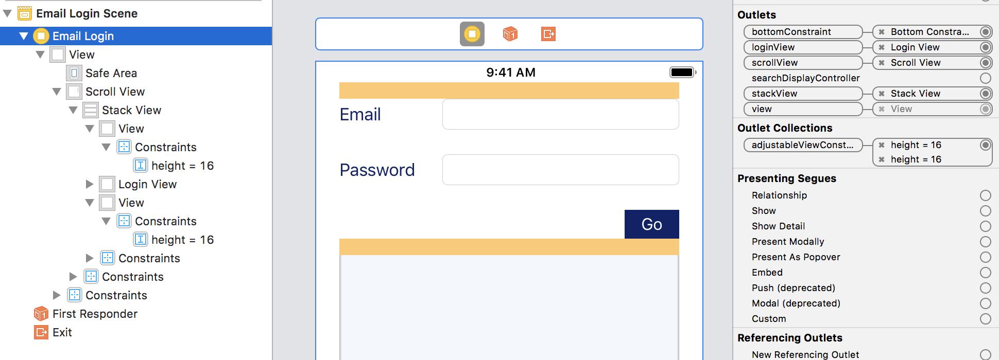

Now lets have a look at the SE again, in normal and large text settings.

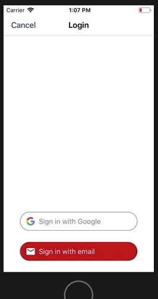

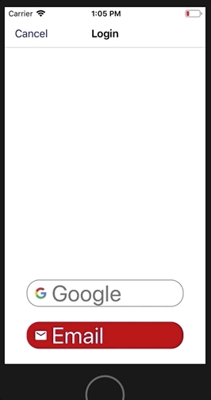

## And we're done
What's the lesson here? Conditionally scroll all the things? Well, yes, more or less. There may be times when you shouldn't or don't need to add scrolling, but they will probably be the exception rather than the rule.

If you're going to have an accessible UI then you need to test it with the largest text sizes and you need to keep in mind that your designer's great work will need to be modified at some point. As long as you keep to their original design as much as possible they should be ok with it.

As developers it's important that we do what we can to remove pain points and friction in our app. We can only gain from thinking about our UI from the perspective of those who have requirements that don't normally occur to us.

I've used a variant of this mix of scroll and stack views in production code and it has made my code and UI much more managable. Plus the accessibility code can be applied to any layout, as a result I have a resuable layout handler that has greatly increased the speed at which I can support and test for accessibility.

Previously I wouldn't have bothered with a `FirebaseEmailLoginView`, I would have just hooked up everything in a view controller, but with this design I was forced to create a view with specific login responsibilities and I was left with a view controller that only has responsibilities for setting up keyboard and accessibility observation. A much smaller and more managable view controller is the end result, and it's not even a "login" view controller any more, it can be reused in multiple scenarios.
